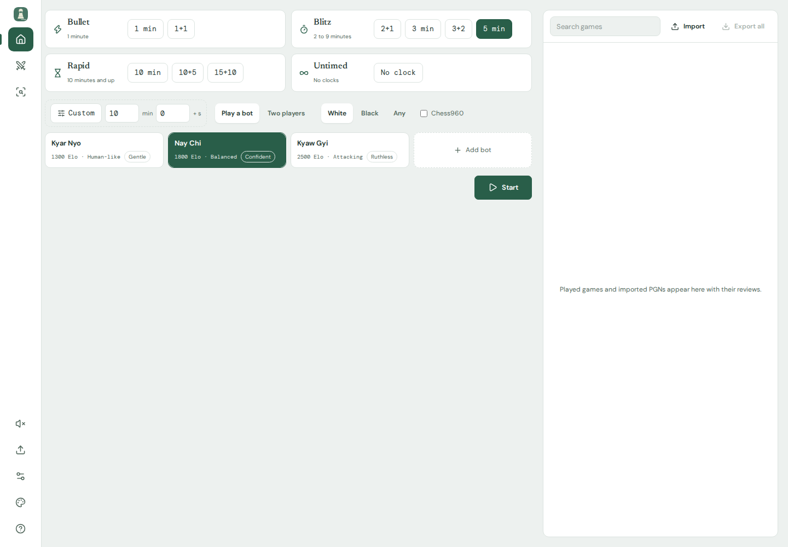
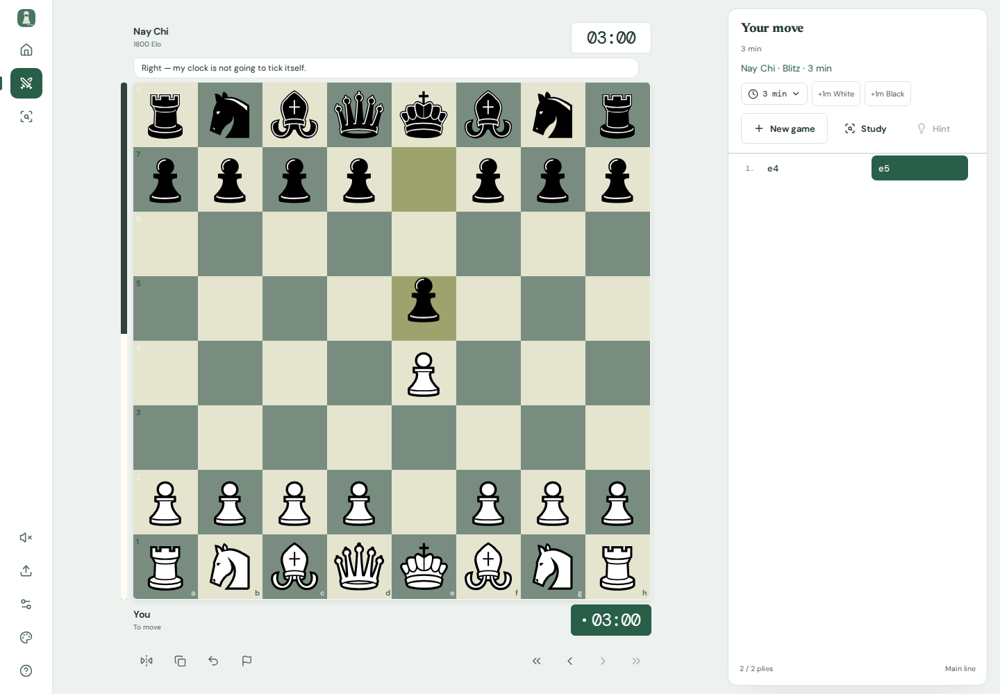

# gwaymaegyi chess

A board-first chess app: a collapsed icon rail, a Home screen for choosing a time
control, and one side card that carries play, analysis, and review. Real Rust-built
WebAssembly. Licensed SVG pieces. Your browser, not a cloud account.





## What works

- **Play against gwaymaegyi:** White or Black, standard chess or any of the 960
  starting positions, custom clocks/increments, promotion, castling, en passant,
  takeback, resignation, and current-position draw claims.
- **Pick an opponent:** six named bots ship with the app (800 Elo up to uncapped),
  and you can add your own with a name, strength, playing style, and a picture
  that stays in the local database. The bot's card is the strength and policy it
  plays, so a saved game always replays as the opponent it was started against.
- **Move naturally:** tap/click, mouse drag, touch drag, or the accessible
  keyboard board. Piece motion respects both your toggle and reduced-motion
  system preferences. Move sound is opt-in.
- **Study a position:** legal moves for both sides, FEN loading/copying,
  full-strength analysis, MultiPV continuations, hints, one combined arrow set,
  and signed evaluation. Every engine result comes from the bundled WASM worker.
- **Keep your games:** one local SQLite record per game, restored after refresh,
  listed on Home with rename/delete and PGN import/export. A reviewed game keeps
  its review evidence and arrows on that same record, so nothing is re-run or
  duplicated.
- **Review real moves:** cancellable, resumable per-position engine searches,
  evaluation chart with keyboard navigation, and transparent centipawn-loss
  annotations. Search budgets accompany cached results.
- **Tune the actual engine:** all 11 discovered behavior switches and 38 numeric
  parameters, policy/strength/seed/hash/MultiPV, scheduling and search limits,
  live performance updates, and Automatic/Portable/SIMD128 selection.
- **Make it yours:** Sage, Walnut, Ocean, and Graphite boards; Chessnut, Celtic,
  and Classic pieces; Light/Dark/System; independent board-aid preferences.

There is no external analysis API, account, telemetry, or game-upload backend.
Assets load from the app's own origin. This is not a service-worker-backed PWA:
initial loading still requires the static app files to be available.

**Source:** https://github.com/codewiththiha/chess

This is an independent frontend repository. The Rust engine repository is
separate and unchanged. GitHub Actions runs full checks on push/PR, with explicit
manual selections for partial runs; see the [CI workflow guide](docs/ci.md).

## Run locally

Use Node.js **24 or newer** and npm. Python 3 is needed for repository checks.

```sh
git clone https://github.com/codewiththiha/chess.git
cd chess
npm ci
npm run dev
```

For the production build:

```sh
npm run build
npm run preview -- --port 5173
```

Open the address printed by Vite. Keep the same origin/port to see the same
SQLite library. Do not open `index.html` directly with `file://`.

No Rust compiler, engine compilation, API keys, or external engine service is
needed for the website. Verified portable and SIMD128 packages are included in
`public/engine`.

## Desktop app

The same revision also builds as a Tauri desktop application:

```sh
npm run tauri -- dev      # native window around the dev server
npm run tauri -- build    # production frontend plus bundles for this OS
```

Only packaging needs Rust (1.77.2 or newer) and the platform Tauri
prerequisites. The shell adds a native window and one host-identity command; the
interface, rules, engine, and SQLite database are the same code the website runs.
The `Desktop` workflow compiles and lints the shell in CI. See
[the desktop notes](docs/desktop.md).

## Verification

```sh
npm run verify              # strict Svelte/TS, lint, format, CI-script/unit tests, build
npx playwright install --only-shell chromium
npm run test:e2e            # production app, desktop + touch-enabled mobile
npm run verify:all          # core checks, workflow lint, and both browser projects
npm run check:commit        # validate the actual HEAD commit message
```

On Linux, Playwright may also require `npx playwright install-deps chromium`.
The browser suite uses port 5173; use a dedicated preview for this project rather
than an unrelated application on that port.

The verification suite contains **98 unit/integration tests** and **62 browser
executions** (31 scenarios on desktop and touch-enabled mobile; the desktop-only
viewport check is skipped on mobile). The actual WASM binaries are exercised, not
replaced with production mocks. Fault simulations are confined to tests. There are
also 14 CI-selection/result regression tests.
See [verification evidence](docs/verification.md) and the [CI guide](docs/ci.md)
for manual skips, project/file filters, reusable workflows, and report artifacts.

## Engine controls and honest limits

| Family         | Browser controls                                                                          |
| -------------- | ----------------------------------------------------------------------------------------- |
| Playing policy | Balanced, Attacking, Human-like, Analysis; nominal Elo 500–3000 or full strength          |
| Resources      | Hash 1–64 MiB; MultiPV 1–32; depth 1–64                                                   |
| Exact integers | Seed 0–18,446,744,073,709,551,615; node budget 1–the same maximum, stored as decimal text |
| Scheduling     | Work/slice 1–65,536; report interval 0–5,000 ms; optional deadline 1–86,400,000 ms        |
| Tuning         | Every discovered behavior and numeric parameter, with actual bounds/defaults              |
| Runtime        | Auto fallback, explicit Portable/SIMD128, stop/restart, actionable startup errors         |

Native SMP Threads, Syzygy, and the native engine's larger resource ranges are
**not available in this WASM build**. They are explained, not represented by
pretend browser toggles. Review uses an independent worker, not search threads.

Hints, analysis, and review use full-strength analysis. Playing presets and the
Elo target apply to engine play. Nominal Elo is **uncalibrated**, not a measured
rating; the interface shows the Elo target instead of an abstract skill level.

Review is not Chess.com accuracy, a brilliant-move detector, or a winning
probability. Categories use before/after centipawn loss: first choice is Best;
otherwise <50 Good, <100 Inaccuracy, <200 Mistake, and ≥200 Blunder. Mate
transitions use ±30,000 cp grading sentinels, which can dominate averages.
Only reported mate metadata is formatted as a mate distance; an already finished
checkmate is labeled as the winning side.

## Storage, clocks, and portability

- Start a game against **a bot** (nominal Elo 500–3000, or uncapped) or in
  **two players** mode, where both colours are yours and no engine ever searches
  for an answer. Study is a view rather than a pause: in a bot game the engine
  answers while study is on screen, and the arrows there are suggestions, never
  during play unless you ask for a hint.
- Study draws 1–4 suggestion arrows (the arrow setting); review always draws the
  single stored best move for the position you are standing on.
- Optional premoves let you queue a move while the engine is thinking; an
  impossible queue is dropped with a notice instead of corrupting the game. Bullet
  never animates pieces, so fast play stays responsive.
- Moves and settings persist locally in SQLite (`@sqlite.org/sqlite-wasm`, OPFS
  shared-access-handle pool with an in-memory fallback for the session). Clocks
  use elapsed monotonic time, not a decrement-per-render counter.
- Timed clocks keep running while you look around: navigating, opening a panel, or
  studying the same record never pauses play. Choose **No clock** on Home for a
  timeless game; that choice is made before the first move.
- One record per game. Studying, importing, or reviewing never forks a copy: a
  repeated game is matched by start date, start position, and its exact move
  sequence, and the stored review moves onto the surviving record.
- Export PGN before clearing browser data or moving to another browser/origin.
  Private-mode or blocked storage falls back to session-only data and is reported;
  failures are surfaced rather than reported as a successful save.
- PGN import supports legal **standard/Chess960 mainlines**, not comments or
  variations. Limits: 2 MB input, 100 games/import, 2,048 plies/game; displayed
  player names are bounded to 120 characters. Use FEN for a position without moves.
- Draw claims cover the current threefold/50-move position; intended-move claims
  are not implemented. Fivefold/75-move draws are automatic.
- Use one active play tab per game. Cross-tab conflict resolution/cloud sync is
  outside this release. Closing a tab is not a guarantee that its final pending
  database write will complete.

## Project map

- [Architecture and invariants](docs/architecture.md)
- [Build plan and acceptance criteria](docs/plan.md)
- [Research and decisions](docs/research.md)
- [Desktop shell and its CI verification](docs/desktop.md)
- [Verification and known coverage limits](docs/verification.md)
- [CI workflows, selective runs, and future test guide](docs/ci.md)
- [Contributor instructions](agents.md)
- [Original researched interface-design skill](.agents/skills/chess-interface-design/SKILL.md)
- [Artwork, engine, and dependency notices](THIRD_PARTY_NOTICES.md)

Scaffolded from Vite's Svelte + TypeScript template, using Svelte 5, Tailwind 4,
daisyUI 5, Chessground, chessops, SQLite WASM, Lucide, and self-hosted fonts. Current
compatible dependency versions are pinned in `package.json` and the npm lockfile.
TypeScript 7 supplies the native checks; TypeScript 6 is the documented compiler-API
bridge required by current Svelte tooling, not an accidental downgrade.

## License and publishing

Authored frontend code: **GPL-3.0-or-later**, with the complete [license](LICENSE).
Bundled engine/models, artwork, fonts, and dependencies retain their own notices.
Do not remove them. A hosted/distributed build must be accompanied by the
corresponding GPL-compatible frontend source, license notices, and a source
location users can actually access. Read [third-party notices](THIRD_PARTY_NOTICES.md)
before distributing builds. The source repository is published separately from
any deployment; CI artifacts do not automatically deploy the application.
